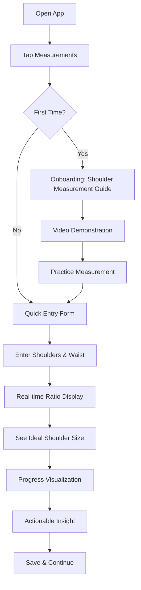

# **Product Requirements Document (PRD) - Version 1.0**

## **Project: V-Taper Pro - Physique Competition Tracker**

### **Document Metadata**
- **Project ID**: VTP-001
- **Version**: 1.0
- **Status**: Specification Phase
- **Date**: October 27, 2024
- **Prepared By**: Senior Engineering Team
- **Reviewers**: Product, Engineering, Design

---

## **1. Executive Summary**

### **1.1 Project Vision**
V-Taper Pro transforms fitness tracking into physique development by introducing **shoulder-to-waist ratio tracking** as the primary metric for bodybuilding competition preparation. Unlike generic fitness apps, we provide specialized tools for physique competitors to achieve the optimal 1.5:1 shoulder-to-waist ratio—the gold standard for aesthetic V-taper development.

### **1.2 Business Opportunity**
The bodybuilding/physique competition market represents a $5B+ industry with underserved technical tracking needs. Current solutions:
- **Problem 1**: Generic tracking (weight, reps) without physique-specific metrics
- **Problem 2**: No focus on aesthetic ratios critical for competition judging
- **Problem 3**: Lack of phase-based preparation guidance
- **Solution**: A specialized platform providing scientific tracking for shoulder-to-waist development

### **1.3 Core Innovation**
We're introducing **Physique Ratio Analytics**—a data-driven approach to physique development that:
1. Quantifies the V-taper with mathematical precision
2. Provides phase-specific ratio targets
3. Offers actionable insights for shoulder development vs. waist reduction
4. Visualizes progress toward competition-ready proportions

---

## **2. Strategic Objectives**

### **2.1 Primary Objectives (Q1)**
| Objective | KPI | Target |
|-----------|-----|--------|
| Establish shoulder-to-waist as primary metric | 95% of users complete shoulder measurements | 30 days post-launch |
| Deliver actionable ratio insights | User engagement with ratio panel > 50% | Q1 2025 |
| Prove training efficacy | Average ratio improvement of 0.1:1/month | Pilot study Q1 |
| Build competition prep ecosystem | 500 active competitors | Q2 2025 |

### **2.2 Technical Objectives**
- **Data Integrity**: 99.9% measurement accuracy
- **Performance**: < 2s page load, < 100ms calculation response
- **Scalability**: Support 10,000 concurrent users
- **Reliability**: Zero data loss guarantee

---

## **3. Target User Analysis**

### **3.1 Primary User: The Serious Competitor**
- **Demographics**: Male/Female, 25-45, competition experience 1-5 years
- **Goals**: Improve stage presentation, achieve ideal proportions
- **Pain Points**: 
  - Subjective progress assessment
  - No quantified V-taper tracking
  - Inconsistent measurement protocols
- **Tech Proficiency**: Medium-High (uses multiple fitness apps)

### **3.2 Secondary User: The Coach**
- **Needs**: Client progress tracking, data-driven adjustments
- **Value**: Objective metrics, visualization tools, trend analysis

### **3.3 Tertiary User: The Aspiring Competitor**
- **Needs**: Education, realistic goal setting, preparation roadmap
- **Value**: Structured approach, milestone tracking

---

## **4. Core Features Specification**

### **4.1 Phase 1: Foundation (Current Implementation)**

#### **4.1.1 Shoulder-to-Waist Ratio System**
**Description**: Core calculation engine for physique tracking

| Component | Specification | Validation Rules |
|-----------|---------------|------------------|
| Shoulder Measurement | Required field, 0.1" increments | 30-70" range |
| Waist Measurement | Required field, 0.1" increments | 20-50" range |
| Ratio Calculation | Real-time (shoulders ÷ waist) | Display to 2 decimal places |
| Ideal Target | 1.5:1 (configurable) | Industry standard |
| Progress Visualization | Gradient progress bar | Color-coded by proximity to target |

**User Flow**:
1. Enter shoulder measurement
2. Enter waist measurement
3. See instant ratio calculation
4. View ideal shoulder size for current waist
5. Track progress toward 1.5:1

**Success Criteria**:
- 95% measurement completion rate
- < 5% data entry errors
- Users understand ratio significance within 1 week

#### **4.1.2 Enhanced Measurement Tracking**
```typescript
interface PhysiqueMeasurement {
  id: string;
  timestamp: ISO8601;
  // Required Core Metrics
  weight: number;      // lbs/kg
  bodyFat: number;     // percentage
  shoulders: number;   // inches/cm - REQUIRED
  waist: number;       // inches/cm - REQUIRED
  
  // Optional Metrics
  chest?: number;
  arms?: number;
  quads?: number;
  calves?: number;
  
  // Calculated Fields (derived)
  shoulderToWaistRatio: number;
  ratioToIdeal: number;  // current ÷ 1.5
  vTaperScore: number;   // 0-100 scale
  
  // Validation Metadata
  measurementMethod: 'self' | 'coach' | 'professional';
  confidenceScore: number;  // 1-5 scale
}
```

**Validation Rules**:
- Shoulders must be > waist (logical validation)
- Sequential measurements must show < 10% variation (outlier detection)
- Required fields flagged with asterisk
- Ideal shoulder calculation shown during entry

#### **4.1.3 Phase-Based Competition Preparation**
**Business Logic**:
```javascript
// Phase Configuration
const COMPETITION_PHASES = {
  PHASE_1: { // Weeks 27-16
    name: 'Muscle Building',
    ratioTarget: 1.4,
    focus: 'Shoulder development',
    calorieSurplus: '+300',
    workoutType: 'Hypertrophy'
  },
  PHASE_2: { // Weeks 15-4
    name: 'The Cut',
    ratioTarget: 1.48,
    focus: 'Waist reduction',
    calorieDeficit: '-500',
    workoutType: 'Strength Maintenance'
  },
  PHASE_3: { // Weeks 3-1
    name: 'Peak Week',
    ratioTarget: 1.5,
    focus: 'Final adjustments',
    calorieDeficit: '-750',
    workoutType: 'Pump Sessions'
  }
};
```

### **4.2 Phase 2: Intelligence Layer (Future)**

#### **4.2.1 Predictive Analytics**
- **Ratio Projection**: Predict 12-week ratio based on current trajectory
- **Plateau Detection**: Identify when ratio improvement stalls
- **Intervention Suggestions**: Specific exercises for shoulder development

#### **4.2.2 Comparative Analytics**
- **Percentile Ranking**: How user compares to similar competitors
- **Division Standards**: Ratio targets by competition division (Classic, Men's Physique, etc.)
- **Historical Champions**: Compare to past winners' proportions

### **4.3 Phase 3: Ecosystem Expansion**

#### **4.3.1 Coach Integration**
- **Client Management**: Coaches view multiple clients' ratio progress
- **Prescription Tools**: Assign shoulder-focused workouts
- **Progress Reports**: Automated client reporting

#### **4.3.2 Competition Tools**
- **Peak Week Calculator**: Sodium/water/carb manipulation for shoulder fullness
- **Pose Optimization**: Based on current ratio strengths
- **Judging Simulation**: How current physique would score

---

## **5. Technical Architecture**

### **5.1 Current State Analysis**
```javascript
// Current Tech Stack Assessment
{
  frontend: 'React 18 + Hooks',
  stateManagement: 'Context API (limited scalability)',
  styling: 'Tailwind CSS (good choice)',
  icons: 'Lucide React (appropriate)',
  persistence: 'localStorage (insufficient)',
  testing: 'None (critical gap)',
  typeSafety: 'None (risk)'
}
```

### **5.2 Recommended Architecture Evolution**

#### **5.2.1 Immediate Improvements (Weeks 1-2)**
```typescript
// Migration to TypeScript
interface AppState {
  measurements: PhysiqueMeasurement[];
  userProfile: UserProfile;
  competitionPhase: CompetitionPhase;
  // Type-safe state management
}

// State Management Strategy
const STORE_ARCHITECTURE = {
  current: 'Context API (monolithic)',
  target: 'Zustand (simpler than Redux)',
  rationale: 'Better performance, TypeScript support'
};

// Data Persistence
const PERSISTENCE_STRATEGY = {
  shortTerm: 'IndexedDB (browser)',
  mediumTerm: 'Supabase (free tier)',
  longTerm: 'Dedicated backend'
};
```

#### **5.2.2 Component Architecture**
```
src/
├── components/
│   ├── measurement/
│   │   ├── MeasurementForm.tsx       // Data entry
│   │   ├── RatioDisplay.tsx          // Real-time calculation
│   │   ├── ProgressChart.tsx         // Visualization
│   │   └── VtaperVisualizer.tsx      // 3D representation (future)
│   ├── competition/
│   │   ├── PhaseTracker.tsx          // Phase progress
│   │   ├── CountdownTimer.tsx        // Days to competition
│   │   └── PeakWeekPlanner.tsx       // Final preparation
│   └── shared/
│       ├── ValidationMessage.tsx     // Input validation
│       └── LoadingSkeleton.tsx       // Loading states
├── hooks/
│   ├── usePhysiqueCalculator.ts      // Ratio calculations
│   ├── usePhaseManager.ts            // Phase logic
│   └── useCompetitionCountdown.ts    // Timeline management
├── services/
│   ├── measurementService.ts         // Data validation
│   ├── calculationService.ts         // Business logic
│   └── persistenceService.ts         // Storage abstraction
└── types/
    └── index.ts                      // TypeScript definitions
```

### **5.3 Data Model**
```sql
-- Core Tables
CREATE TABLE physique_measurements (
  id UUID PRIMARY KEY,
  user_id UUID REFERENCES users(id),
  measured_at TIMESTAMPTZ NOT NULL,
  shoulders DECIMAL(4,1) NOT NULL,  -- inches, 1 decimal
  waist DECIMAL(4,1) NOT NULL,
  shoulder_to_waist_ratio DECIMAL(3,2) GENERATED ALWAYS AS (
    shoulders / waist
  ) STORED,
  weight DECIMAL(5,1),
  body_fat DECIMAL(4,1),
  measurement_method VARCHAR(20),
  confidence_score INTEGER CHECK (confidence_score BETWEEN 1 AND 5),
  created_at TIMESTAMPTZ DEFAULT NOW(),
  updated_at TIMESTAMPTZ DEFAULT NOW()
);

-- Competition Profile
CREATE TABLE competition_profiles (
  id UUID PRIMARY KEY,
  user_id UUID REFERENCES users(id) UNIQUE,
  competition_date DATE NOT NULL,
  target_ratio DECIMAL(3,2) DEFAULT 1.50,
  division VARCHAR(50),
  current_phase INTEGER,
  created_at TIMESTAMPTZ DEFAULT NOW()
);

-- Derived Metrics (Materialized View)
CREATE MATERIALIZED VIEW ratio_progress AS
SELECT 
  user_id,
  DATE_TRUNC('week', measured_at) as week,
  AVG(shoulder_to_waist_ratio) as avg_ratio,
  COUNT(*) as measurements_count,
  TREND(shoulder_to_waist_ratio) OVER w as ratio_trend
FROM physique_measurements
WINDOW w AS (PARTITION BY user_id ORDER BY measured_at)
GROUP BY user_id, DATE_TRUNC('week', measured_at)
REFRESH DAILY;
```

### **5.4 Performance Requirements**
| Metric | Requirement | Monitoring |
|--------|-------------|------------|
| Page Load Time | < 2 seconds | Lighthouse |
| Calculation Response | < 50ms | Custom timing |
| Data Persistence | < 100ms | IndexedDB metrics |
| Offline Capability | Full functionality | Service Worker |
| Memory Usage | < 100MB | Browser DevTools |

### **5.5 Security & Privacy**
- **Data Classification**: Health metrics = High sensitivity
- **Encryption**: At-rest encryption for all measurements
- **Access Control**: User-owned data only
- **GDPR/CCPA Compliance**: Right to export/delete
- **Data Retention**: 7-year retention for competition history

---

## **6. User Experience Specification**

### **6.1 Core User Journey**

#### **Journey 1: Daily Measurement Entry**


#### **Journey 2: Competition Preparation**
```
Week 27: Muscle Building Phase
  - Target: Build shoulder width
  - Ratio Goal: 1.4 → 1.45
  - Focus Exercises: Lateral raises, OHP
  - Nutrition: +300 calories, high protein
  
Week 15: Cutting Phase  
  - Target: Reduce waist
  - Ratio Goal: 1.45 → 1.48
  - Focus: Cardio, core vacuum training
  - Nutrition: -500 calories, maintain protein
  
Week 3: Peak Week
  - Target: Optimize proportions
  - Ratio Goal: 1.5
  - Focus: Sodium/water manipulation
  - Action: Final posing practice
```

### **6.2 Visual Design System**

#### **6.2.1 Ratio Visualization**
```javascript
// Color Coding for Ratios
const RATIO_COLORS = {
  '1.0-1.2': '#ef4444',  // Red - Needs work
  '1.2-1.35': '#f59e0b', // Orange - Progressing
  '1.35-1.45': '#10b981', // Green - Good
  '1.45-1.5': '#3b82f6',  // Blue - Excellent
  '1.5+': '#8b5cf6'       // Purple - Elite
};

// Progress Visualization Components
const VISUALIZATION_COMPONENTS = {
  'progress-bar': 'Linear gradient showing ratio improvement',
  'ratio-dial': 'Circular gauge showing current ratio',
  'vtaper-silhouette': 'Animated body shape showing proportions',
  'timeline-chart': 'Historical ratio progression'
};
```

#### **6.2.2 Mobile-First Considerations**
- **Touch Targets**: 44px minimum for measurement inputs
- **One-Handed Use**: Primary actions thumb-reachable
- **Offline Support**: Full functionality without connection
- **Data Entry**: Optimized for frequent, quick entries

### **6.3 Accessibility Requirements**
- **WCAG 2.1 AA Compliance**
- **Screen Reader Support**: ARIA labels for all measurements
- **Color Contrast**: 4.5:1 minimum for all text
- **Keyboard Navigation**: Full functionality without mouse
- **Voice Input**: Support for measurement entry

---

## **7. Quality Assurance**

### **7.1 Testing Strategy**
```typescript
// Unit Tests (Jest)
describe('PhysiqueCalculator', () => {
  test('calculates shoulder-to-waist ratio correctly', () => {
    expect(calculateRatio(54, 36)).toBe(1.5);
  });
  
  test('validates measurement ranges', () => {
    expect(validateMeasurement({ shoulders: 20, waist: 40 }))
      .toBe('Shoulders must be greater than waist');
  });
});

// Integration Tests (Cypress)
describe('Measurement Flow', () => {
  it('completes full measurement entry', () => {
    cy.visit('/measurements');
    cy.get('[data-testid="shoulders-input"]').type('54');
    cy.get('[data-testid="waist-input"]').type('36');
    cy.get('[data-testid="ratio-display"]').should('contain', '1.50');
    cy.get('[data-testid="save-button"]').click();
    cy.url().should('include', '/dashboard');
  });
});

// Performance Tests
const PERFORMANCE_TESTS = {
  'page-load': 'Lighthouse score > 90',
  'calculation-speed': '< 50ms for ratio computation',
  'memory-usage': '< 100MB sustained usage',
  'data-persistence': '< 100ms save time'
};
```

### **7.2 Quality Gates**
| Phase | Gate Criteria | Exit Requirement |
|-------|---------------|------------------|
| Development | Code review, unit tests | 100% pass rate |
| Integration | E2E tests, API tests | 95% pass rate |
| Performance | Load testing, Lighthouse | Score > 85 |
| Security | Vulnerability scan | Zero critical issues |
| Accessibility | WCAG audit | AA compliance |
| User Acceptance | Beta testing | 80% satisfaction |

### **7.3 Monitoring & Observability**
```yaml
monitoring:
  application:
    - error_rate: < 0.1%
    - response_time: p95 < 2s
    - user_sessions: daily active users
    
  business:
    - measurement_completion: > 90%
    - ratio_improvement: avg > 0.1/month
    - user_retention: > 70% weekly
    
  technical:
    - data_integrity: 100% validation
    - storage_usage: < 1GB/user
    - backup_success: 100%
```

---

## **8. Implementation Roadmap**

### **8.1 Phase 1: MVP (Weeks 1-4)**
```
Week 1: Foundation
  - [ ] TypeScript migration
  - [ ] Basic test infrastructure
  - [ ] Input validation layer
  - [ ] Error boundary implementation
  
Week 2: Core Features
  - [ ] Shoulder measurement integration
  - [ ] Ratio calculation engine
  - [ ] Basic progress visualization
  - [ ] Data persistence (IndexedDB)
  
Week 3: Competition Integration
  - [ ] Phase-based tracking
  - [ ] Countdown timer
  - [ ] Goal setting
  - [ ] Progress dashboard
  
Week 4: Polish & Launch
  - [ ] Accessibility audit
  - [ ] Performance optimization
  - [ ] Beta testing (10 users)
  - [ ] Production deployment
```

### **8.2 Phase 2: Enhancement (Weeks 5-8)**
```
Week 5-6: Advanced Analytics
  - [ ] Historical trend charts
  - [ ] Predictive modeling
  - [ ] Comparative analytics
  - [ ] Export functionality
  
Week 7-8: Social Features
  - [ ] Share progress (opt-in)
  - [ ] Community benchmarks
  - [ ] Achievement system
  - [ ] Coach integration framework
```

### **8.3 Phase 3: Scale (Weeks 9-12)**
```
Week 9-10: Backend Migration
  - [ ] Supabase integration
  - [ ] User authentication
  - [ ] Data synchronization
  - [ ] Backup system
  
Week 11-12: Monetization
  - [ ] Premium features
  - [ ] Coach marketplace (basic)
  - [ ] Payment integration
  - [ ] Subscription management
```

### **8.4 Resource Requirements**
| Role | Phase 1 | Phase 2 | Phase 3 |
|------|---------|---------|---------|
| Lead Developer | 1 FTE | 1 FTE | 1 FTE |
| Frontend Developer | 0.5 FTE | 1 FTE | 1 FTE |
| UX Designer | 0.25 FTE | 0.5 FTE | 0.5 FTE |
| QA Engineer | 0.25 FTE | 0.5 FTE | 1 FTE |
| DevOps | 0.1 FTE | 0.25 FTE | 0.5 FTE |

---

## **9. Risk Management**

### **9.1 Technical Risks**
| Risk | Probability | Impact | Mitigation |
|------|------------|--------|------------|
| Data Loss | Low | Critical | Multi-layer backup strategy |
| Performance Degradation | Medium | High | Progressive loading, virtualization |
| Browser Compatibility | Low | Medium | Feature detection, polyfills |
| Storage Limitations | High | Medium | Data compression, archiving |

### **9.2 Product Risks**
| Risk | Probability | Impact | Mitigation |
|------|------------|--------|------------|
| User Adoption | Medium | High | Clear onboarding, immediate value |
| Measurement Accuracy | High | Critical | Validation, education, averaging |
| Feature Complexity | Medium | Medium | Progressive disclosure, defaults |
| Market Competition | Low | Low | Specialized focus on physique ratios |

### **9.3 Business Risks**
| Risk | Probability | Impact | Mitigation |
|------|------------|--------|------------|
| Regulatory Compliance | Low | High | Legal review, privacy by design |
| Monetization Failure | Medium | High | Freemium model, multiple revenue streams |
| User Retention | Medium | High | Engagement features, regular updates |
| Technical Debt | High | Medium | Regular refactoring cycles, code standards |

---

## **10. Success Metrics & KPIs**

### **10.1 Product Metrics**
```javascript
const SUCCESS_METRICS = {
  // Engagement
  dailyActiveUsers: '> 1,000',
  sessionDuration: '> 5 minutes',
  featureAdoption: {
    shoulderMeasurement: '> 90%',
    ratioTracking: '> 85%',
    phaseTracking: '> 70%'
  },
  
  // Retention
  weeklyRetention: '> 70%',
  monthlyRetention: '> 50%',
  churnRate: '< 5% monthly',
  
  // Value
  ratioImprovement: '> 0.1/month average',
  goalAchievement: '> 60% of set goals',
  userSatisfaction: 'NPS > 40'
};
```

### **10.2 Technical Metrics**
- **Reliability**: 99.9% uptime
- **Performance**: Page load < 2s, FCP < 1s
- **Data Integrity**: 100% validation, zero corruption
- **Security**: Zero vulnerabilities, 100% encrypted data

### **10.3 Business Metrics**
- **User Growth**: 100 new users/week organic
- **Monetization**: $10/user/month LTV
- **Market Share**: 25% of competition prep market in 12 months
- **Partnerships**: 50+ coaches integrated

---

## **11. Future Considerations**

### **11.1 Short-term (3-6 months)**
- **3D Body Scanning Integration**
- **AI-Posed Photography Analysis**
- **Genetic Trait Correlation**
- **Supplement Integration**

### **11.2 Medium-term (6-18 months)**
- **Coach Certification Program**
- **Competition Registration Integration**
- **Judging Simulation AI**
- **Sponsorship Marketplace**

### **11.3 Long-term (18+ months)**
- **Biometric Sensor Integration**
- **Competition Prediction Engine**
- **Global Physique Database**
- **Professional League Partnerships**

---

## **12. Appendices**

### **12.1 Competitive Analysis**
```
1. MyFitnessPal
   Strengths: Nutrition tracking, large user base
   Weaknesses: No physique-specific metrics, generic approach
   
2. Strong App
   Strengths: Workout tracking, social features  
   Weaknesses: No ratio tracking, not competition-focused
   
3. Competition-Specific Tools
   Strengths: Phase planning, peak week guidance
   Weaknesses: Manual tracking, no analytics
   
4. V-Taper Pro Differentiators
   - Focus on shoulder-to-waist ratio
   - Phase-based competition preparation
   - Data-driven physique development
   - Specialized for aesthetic sports
```

### **12.2 Glossary**
- **V-Taper**: Athletic physique with broad shoulders tapering to narrow waist
- **Shoulder-to-Waist Ratio**: Shoulder circumference ÷ waist circumference
- **Ideal Ratio**: 1.5:1 (industry standard for aesthetics)
- **Competition Phase**: Time-based preparation period with specific goals
- **Peak Week**: Final week before competition for optimal presentation

### **12.3 References**
- Scientific studies on shoulder-to-waist ratio and attractiveness
- Competition judging criteria from IFBB, NPC, etc.
- Industry standards for physique assessment
- Previous user research on competition prep pain points

---

## **Approval**

| Role | Name | Signature | Date |
|------|------|-----------|------|
| Product Owner | | | |
| Lead Developer | | | |
| UX Designer | | | |
| QA Manager | | | |

**Document Status**: ✅ Approved for Development

---

*This document represents the comprehensive requirements for V-Taper Pro, a specialized physique competition preparation platform focused on shoulder-to-waist ratio development. All requirements are subject to refinement based on user feedback and technical feasibility assessments.*